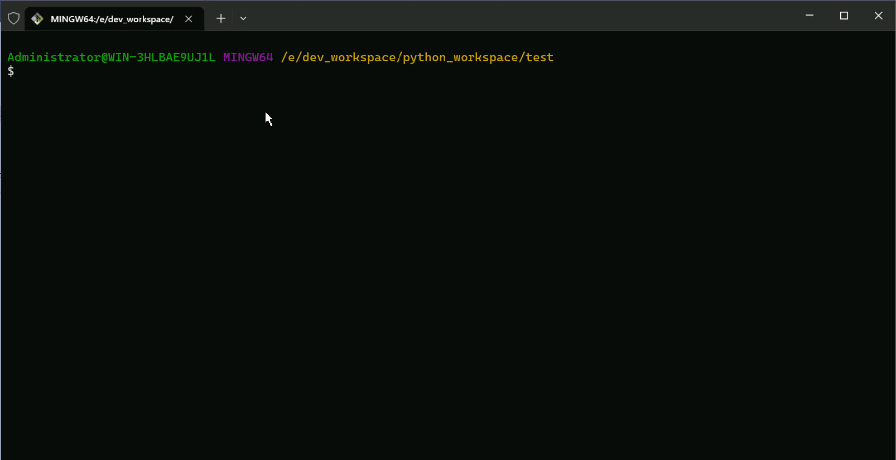

# cookiecutter-base-fastapi

一个基于`cookiecutter`搭建的FastAPI基础项目模板，提供了完整的项目结构、日志配置、环境变量管理和API示例。
  
用于快速创建FastAPI项目的标准模板。 🚀  

## 重要说明  

使用本项目无需fork，直接运行cookiecutter命令行工具即可一键生成！  

## Cookiecutter介绍  

Cookiecutter是一个命令行工具(CLI)，用于从模板创建项目脚手架。它使用Jinja2模板引擎来自定义文件夹/文件名以及文件内容。  

🔍 [Cookiecutter](https://github.com/cookiecutter/cookiecutter)

### 安装

使用 pip 包管理器安装 cookiecutter，安装选项如下：

✅ 可选一（推荐）

```bash
# 强烈推荐使用pipx
pipx install cookiecutter
```

✅ 可选二
  
```bash
# 如果pipx不是必须得，您可以在Python用户目录中安装cookiecutter
python -m pip install --user cookiecutter
```

✅ 可选三

```bash
# 直接安装
pip install cookiecutter  
```

验证是否生效

```
cookiecutter --version
```

### 生成FastAPI项目
```bash  
cookiecutter gh:tuonioooo/cookiecutter-base-fastapi 
```  

### 操作演示  

  


[MIT](LICENSE)

